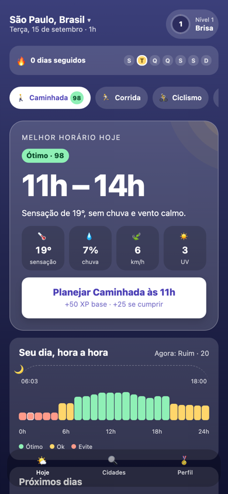
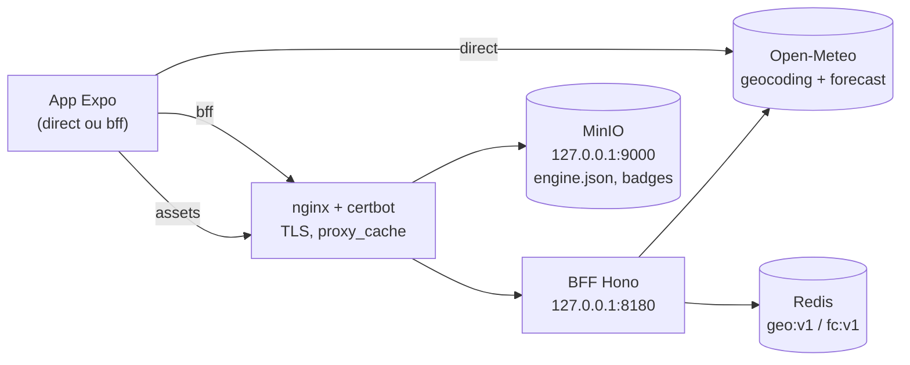

[](https://github.com/M4rdine/Bora-marcar-/actions/workflows/ci.yml)

# Bora marcar

App React Native (Expo) que transforma a previsão hora a hora da Open-Meteo em uma
recomendação simples: o melhor horário do dia para uma atividade ao ar livre, com
gamificação de verdade (XP, níveis, streak protegido por mau tempo, badges) para criar o
hábito.

| Boas-vindas                                                           | Planejar                                                                    | Recibo de XP                                                                        |
| --------------------------------------------------------------------- | --------------------------------------------------------------------------- | ----------------------------------------------------------------------------------- |
|  |  |  |

Mais capturas (estados "É agora", "Sem janela boa", detalhe do dia, Perfil) em
`docs/superpowers/qa/2026-09-15-web-depois/`.

## Rodar em 3 comandos

```bash
pnpm install
pnpm --filter mobile start   # QR code para o Expo Go (iOS/Android)
pnpm test                    # testes com cobertura em todos os pacotes
```

Sem nenhuma variável de ambiente configurada, o app fala direto com a Open-Meteo (modo
`direct` — ver "Modos direct/bff" abaixo). `pnpm lint` e `pnpm typecheck` rodam lint e
checagem de tipos em todo o monorepo.

## Modos `direct` e `bff`

`EXPO_PUBLIC_API_MODE=direct|bff` (padrão `direct`) escolhe os adapters em
`apps/mobile/src/infrastructure/adapters.ts`. Em `direct`, o app fala direto com a
Open-Meteo e usa a config embutida — é o modo em que o avaliador roda sem configurar nada.
Em `bff`, o app fala com o BFF publicado e a config remota:

```bash
# apps/mobile/.env (opcional)
EXPO_PUBLIC_API_MODE=bff
EXPO_PUBLIC_BFF_URL=https://bora-marcar.duckdns.org
EXPO_PUBLIC_ASSETS_URL=https://bora-marcar.duckdns.org
```

Domínio único: API na raiz, assets em `/config/` e `/assets/` do mesmo host. O ambiente está
no ar — dá para conferir sem clonar nada:

```bash
curl -s https://bora-marcar.duckdns.org/health
curl -sI https://bora-marcar.duckdns.org/v1/forecast?lat=-23.55&lon=-46.63 | grep -i x-cache  # MISS
curl -sI https://bora-marcar.duckdns.org/v1/forecast?lat=-23.55&lon=-46.63 | grep -i x-cache  # HIT
curl -s https://bora-marcar.duckdns.org/config/v1/engine.json | head -c 80
```

Em `bff`, as duas variáveis são obrigatórias — sem
elas, ou com uma URL inválida, o app falha alto com uma tela de erro em vez de cair para
`direct` em silêncio (ADR 0006).

## Arquitetura



Quatro camadas em `apps/mobile/src` (hexagonal leve, ADR 0002):

- **`domain`** — regras puras (motor de recomendação e gamificação), zero dependências,
  100 % de cobertura.
- **`application`** — ports (interfaces) e casos de uso que devolvem `Result`, nunca
  lançam.
- **`infrastructure`** — um adapter por port (Open-Meteo direto, BFF, AsyncStorage,
  expo-location, expo-notifications); `container.ts` monta tudo por `EXPO_PUBLIC_API_MODE`.
- **`presentation`** — Expo Router, TanStack Query, Zustand, design system (`ui/`) e telas
  por feature; `HomeScreen.msw.test.tsx` é a exceção deliberada que exercita os adapters
  reais do Open-Meteo por trás do MSW.

As dependências entre camadas são impostas por `eslint-plugin-boundaries`
(`apps/mobile/eslint.config.js`). Decisões completas em `docs/adr/` (índice em
`docs/adr/README.md`).

## Como o motor decide

Cada hora vira um score de 0 a 100. Cinco fatores — térmico, chuva, vento, UV e sol — viram
um "conforto" de 0 a 1 por curva linear por partes (`apps/mobile/src/domain/recommendation/comfort.ts`),
são ponderados pelos pesos da atividade e multiplicados por um fator noturno fora do dia:

```
base   = Σ peso_fator × conforto_fator
score  = round(100 × base × luz)     // luz = 1 de dia, fator noturno à noite
```

**Exemplo verificado por teste** (`apps/mobile/src/domain/recommendation/readmeExample.test.ts`),
caminhada às 16h com sensação térmica 24 °C, 10 % de chance de chuva, 0 mm, vento 12 km/h,
UV 6, céu 30 % nublado, de dia:

| Fator   | Conforto | Peso da caminhada |
| ------- | -------: | ----------------: |
| Térmico |        1 |              0,40 |
| Chuva   |        1 |              0,30 |
| Vento   |        1 |              0,15 |
| UV      |    0,825 |              0,10 |
| Sol     |        1 |              0,05 |

```
base  = 0,40×1 + 0,30×1 + 0,15×1 + 0,10×0,825 + 0,05×1 = 0,9825
score = round(100 × 0,9825 × 1) = 98  → rótulo "Ótimo"
```

A frase que o app gera para essa hora (`buildSentence`, junta os fatores de maior peso):
_"Sensação de 24°, baixa chance de chuva e vento leve."_

**Vetos** (aplicados depois da média, o menor vence): trovoada zera o score mesmo com os
outros fatores perfeitos; chuva ≥ 80 % ou ≥ 1 mm e neve limitam a 20; sensação térmica fora
da faixa de tolerância limita a 30; nevoeiro no ciclismo multiplica por 0,6
(`apps/mobile/src/domain/recommendation/vetoes.ts`).

**Janela**: o motor testa blocos contíguos de 1, 2 e 3 horas, descarta blocos com alguma
hora abaixo de 45 e escolhe pela média + um bônus por hora adicional (para uma janela de 3 h
conseguir vencer uma de 1 h isolada). **A madrugada** (antes de `window.quietHoursEnd = 5h`)
nunca entra como candidata a janela — o score dessas horas continua real na linha do dia e
no XP de quem sair mesmo assim, só não vira recomendação (`apps/mobile/src/domain/recommendation/windows.ts`,
achado #1 de `docs/superpowers/qa/2026-09-15-qa-visual-web.md`).

## Gamificação

Ciclo: planejar → lembrete local → confirmar (ou registrar sem plano) → XP → nível →
badges → streak. Progresso é um log de eventos imutável (`progress:v1`), estado derivado
por `deriveProgress` (ADR 0003) — nada de contador guardado direto.

XP por atividade (`apps/mobile/src/domain/gamification/xp.ts`):

| Parcela        | Valor                                             |
| -------------- | ------------------------------------------------- |
| Base           | 50                                                |
| Horário        | `round(hourScore / 2)`                            |
| Plano cumprido | +25 (confirmou dentro da janela ou até 2h depois) |
| Sequência      | `5 × min(streak, 10)`                             |

Só o primeiro registro do dia conta XP. **Streak protegido**: um dia sem janela boa
(`badWeatherDay`) não quebra nem incrementa a sequência — qualquer outro dia sem atividade
zera (`apps/mobile/src/domain/gamification/streak.ts`). Oito níveis (Brisa → Clima
Perfeito, XP acumulado `100 × (N−1)²`) e oito badges com progresso visível quando contável
("7/10").

## Qualidade

| Pacote               | Testes                 | Cobertura (stmts / branches) | Observação                              |
| -------------------- | ---------------------- | ---------------------------- | --------------------------------------- |
| `apps/mobile`        | 85 suítes, 546 testes  | 97,86 % / 93,31 %            | domínio em 100 % (limiar imposto no CI) |
| `apps/bff`           | 12 arquivos, 47 testes | 95,66 % / 92,24 %            | Vitest + Redis real em container        |
| `packages/contracts` | 4 arquivos, 28 testes  | 100 % / 97,5 %               | schemas Zod compartilhados              |

TypeScript `strict` + `noUncheckedIndexedAccess`; ESLint com `eslint-plugin-boundaries` e
`no-console`; Prettier; Husky + lint-staged + commitlint (conventional commits). CI
(`.github/workflows/ci.yml`) roda `format`, `mobile`, `bff` (com Redis de serviço) e
`contracts` em paralelo a cada push/PR; `deploy-bff.yml` builda e publica a imagem no GHCR e
faz o deploy na VPS após o CI passar; `publish-assets.yml` envia `engine.json` e os assets
para o MinIO manualmente.

## Infra

BFF (Hono + Redis) e o bucket de assets (MinIO) rodam na VPS atrás do nginx do sistema
(TLS via certbot, `proxy_cache` como borda) — detalhes, topologia e scripts de deploy em
[`infra/README.md`](infra/README.md); API do BFF em [`apps/bff/README.md`](apps/bff/README.md).

## Decisões e trade-offs

Registradas como ADRs em [`docs/adr/`](docs/adr/README.md):

- [0001](docs/adr/0001-expo-managed.md) Expo managed + Expo Go como alvo do avaliador.
- [0002](docs/adr/0002-hexagonal-leve.md) Arquitetura hexagonal leve com quatro camadas.
- [0003](docs/adr/0003-event-sourcing-local.md) Event sourcing local para a gamificação.
- [0004](docs/adr/0004-bff-com-cache-redis.md) BFF com cache Redis.
- [0005](docs/adr/0005-config-remota-do-motor.md) Config remota do motor.
- [0006](docs/adr/0006-fallback-direto-por-env.md) Fallback direto por variável de ambiente.
- [0007](docs/adr/0007-motor-no-dispositivo.md) Motor no dispositivo, não no servidor.
- [0008](docs/adr/0008-nginx-existente-em-vez-de-caddy.md) nginx existente em vez de Caddy.

Roteiro completo de apresentação (os dez pontos do spec + dois extras da QA visual) em
[`docs/apresentacao.md`](docs/apresentacao.md).

## O que faria com mais tempo

Itens fora de escopo do núcleo (spec, seção 2, "Opcionais — fazer só se o núcleo estiver
pronto antes do prazo"), nenhum implementado ainda:

- Melhor horário por atividade lado a lado ("Hoje: Corrida 7h, Praia 14h...").
- Selo de confiança da previsão por dia (alta para hoje e amanhã, média para os dias 4–5).
- EAS Build com APK de preview e EAS Update para OTA.
- E2E Maestro no CI (exige runner macOS).
- Cloudflare proxiada como CDN na frente do nginx, condicional a um domínio próprio
  registrado nela (hoje o `proxy_cache` do nginx já faz o papel de cache de borda — ver
  `infra/README.md`, "O que a Cloudflare acrescentaria").

## QA visual

Antes da entrega, o app (alvo `react-native-web`, só para QA) foi comparado pixel a pixel
com o mockup aprovado via Chrome DevTools Protocol: harness em `tools/qa-web/`, relatório
completo com 16 achados e decisões em
[`docs/superpowers/qa/2026-09-15-qa-visual-web.md`](docs/superpowers/qa/2026-09-15-qa-visual-web.md),
capturas antes/depois em `docs/superpowers/qa/2026-09-15-web/` e
`docs/superpowers/qa/2026-09-15-web-depois/`.
