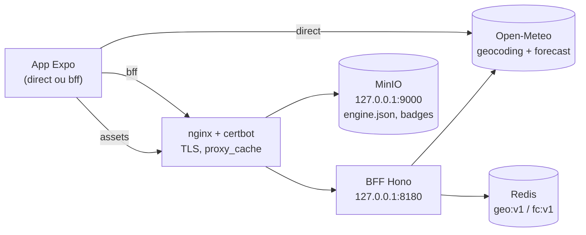

[](https://github.com/M4rdine/Bora-marcar-/actions/workflows/ci.yml)

# Bora marcar

App React Native (Expo) que transforma a previsão hora a hora da Open-Meteo em uma
recomendação simples: o melhor horário do dia para uma atividade ao ar livre, com
gamificação de verdade (XP, níveis, streak protegido por mau tempo, badges) para criar o
hábito.

| Boas-vindas                                                           | Planejar                                                                    | Recibo de XP                                                                        |
| --------------------------------------------------------------------- | --------------------------------------------------------------------------- | ----------------------------------------------------------------------------------- |
|  |  |  |

Mais capturas (estados "É agora", "Sem janela boa", detalhe do dia, Perfil) em
`docs/superpowers/qa/2026-09-15-web-depois/`.

## Rodar em 3 comandos

```bash
pnpm install
pnpm --filter mobile start   # QR code para o Expo Go (iOS/Android)
pnpm test                    # testes com cobertura em todos os pacotes
```

Sem nenhuma variável de ambiente configurada, o app fala direto com a Open-Meteo (modo
`direct` — ver "Modos direct/bff" abaixo). `pnpm lint` e `pnpm typecheck` rodam lint e
checagem de tipos em todo o monorepo.

## Modos `direct` e `bff`

`EXPO_PUBLIC_API_MODE=direct|bff` (padrão `direct`) escolhe os adapters em
`apps/mobile/src/infrastructure/adapters.ts`. Em `direct`, o app fala direto com a
Open-Meteo e usa a config embutida — é o modo em que o avaliador roda sem configurar nada.
Em `bff`, o app fala com o BFF publicado e a config remota:

```bash
# apps/mobile/.env (opcional)
EXPO_PUBLIC_API_MODE=bff
EXPO_PUBLIC_BFF_URL=https://bora-marcar.duckdns.org
EXPO_PUBLIC_ASSETS_URL=https://bora-marcar.duckdns.org
```

Domínio único: API na raiz, assets em `/config/` e `/assets/` do mesmo host. O ambiente está
no ar — dá para conferir sem clonar nada:

```bash
curl -s https://bora-marcar.duckdns.org/health
curl -sI https://bora-marcar.duckdns.org/v1/forecast?lat=-23.55&lon=-46.63 | grep -i x-cache  # MISS
curl -sI https://bora-marcar.duckdns.org/v1/forecast?lat=-23.55&lon=-46.63 | grep -i x-cache  # HIT
curl -s https://bora-marcar.duckdns.org/config/v1/engine.json | head -c 80
```

**App rodando no navegador:** <https://bora-marcar.duckdns.org/app/> — é o mesmo código React
Native compilado para web (`infra/publish-web.sh`), já em modo `bff` contra essa API. Serve para
ver o app sem instalar nada; o alvo oficial continua sendo o Expo Go ou um build nativo, porque
as notificações locais não existem no navegador.

Em `bff`, as duas variáveis são obrigatórias — sem
elas, ou com uma URL inválida, o app falha alto com uma tela de erro em vez de cair para
`direct` em silêncio (ADR 0006).

## Arquitetura



Cinco camadas em `apps/mobile/src` (hexagonal leve, ADR 0002), com as dependências apontando
sempre para dentro:

- **`domain`** — regras puras (motor de recomendação e gamificação), zero dependências,
  100 % de cobertura.
- **`application`** — ports (interfaces) e casos de uso que devolvem `Result`, nunca
  lançam.
- **`infrastructure`** — um adapter por port (Open-Meteo direto, BFF, AsyncStorage,
  expo-location, expo-notifications); `container.ts` monta tudo por `EXPO_PUBLIC_API_MODE`.
- **`presentation`** — TanStack Query, Zustand, design system (`ui/`) e telas por feature;
  `HomeScreen.msw.test.tsx` é a exceção deliberada que exercita os adapters reais do
  Open-Meteo por trás do MSW.
- **`app`** — as rotas do Expo Router. Seis arquivos, só amarração.

As dependências entre camadas são impostas por `eslint-plugin-boundaries`
(`apps/mobile/eslint.config.js`). Decisões completas em `docs/adr/` (índice em
`docs/adr/README.md`).

## Como o motor decide

Cada hora vira um score de 0 a 100. Seis fatores — térmico, chuva, vento, UV, sol e pressão
— viram um "conforto" de 0 a 1 por curva linear por partes
(`apps/mobile/src/domain/recommendation/comfort.ts`), são ponderados pelos pesos da atividade
e multiplicados por um fator noturno fora do dia:

```
base   = Σ peso_fator × conforto_fator
score  = round(100 × base × luz)     // luz = 1 de dia, fator noturno à noite
```

**Exemplo verificado por teste** (`apps/mobile/src/domain/recommendation/readmeExample.test.ts`),
caminhada às 16h com sensação térmica 24 °C, 10 % de chance de chuva, 0 mm, vento 12 km/h,
UV 6, céu 30 % nublado, de dia:

| Fator   | Conforto | Peso da caminhada |
| ------- | -------: | ----------------: |
| Térmico |        1 |              0,40 |
| Chuva   |        1 |              0,30 |
| Vento   |        1 |              0,15 |
| UV      |    0,825 |              0,10 |
| Sol     |        1 |              0,05 |
| Pressão |      0,7 |              0,00 |

```
base  = 0,40×1 + 0,30×1 + 0,15×1 + 0,10×0,825 + 0,05×1 + 0,00×0,7 = 0,9825
score = round(100 × 0,9825 × 1) = 98  → rótulo "Ótimo"
```

A frase que o app gera para essa hora (`buildSentence`, junta os fatores de maior peso):
_"Sensação de 24°, baixa chance de chuva e vento leve."_

**Vetos** (aplicados depois da média, o menor vence): trovoada zera o score mesmo com os
outros fatores perfeitos; chuva ≥ 80 % ou ≥ 1 mm e neve limitam a 20; sensação térmica fora
da faixa de tolerância limita a 30; nevoeiro no ciclismo multiplica por 0,6
(`apps/mobile/src/domain/recommendation/vetoes.ts`).

**Pressão** é o único fator que não olha o valor, e sim a **tendência**: 1022 hPa não diz
nada sozinho, mas caindo 3 hPa em três horas significa frente chegando — e é quando o peixe
sobe para se alimentar. Tendência precisa das horas vizinhas, e o motor pontua uma hora de
cada vez; por isso o derivado (`pressureTrendHpa`) nasce no mapeamento, junto da série, e
chega ao motor como dado — mantendo a função de conforto pura. O cálculo mora em
`mapForecast` (`packages/contracts`), que o BFF e o adaptador direto compartilham: uma
implementação, os dois caminhos. A curva não depende do perfil; quem decide se a pressão
importa é o **peso** da atividade, e só a pesca tem peso nela (0,35). Há teste garantindo
que a nota das outras cinco é idêntica com pressão caindo e subindo.

**Janela**: o motor testa blocos contíguos de 1, 2 e 3 horas, descarta blocos com alguma
hora abaixo de 45 e escolhe pela média + um bônus por hora adicional (para uma janela de 3 h
conseguir vencer uma de 1 h isolada). **A madrugada** (antes de `window.quietHoursEnd = 5h`)
nunca entra como candidata a janela — o score dessas horas continua real na linha do dia e
no XP de quem sair mesmo assim, só não vira recomendação (`apps/mobile/src/domain/recommendation/windows.ts`,
achado #1 de `docs/superpowers/qa/2026-09-15-qa-visual-web.md`).

## Atividades

Seis perfis, e a diferença entre eles é o produto: mesma previsão, recomendações
diferentes.

| Atividade  | O que mais pesa               | Particularidade                                 |
| ---------- | ----------------------------- | ----------------------------------------------- |
| Caminhada  | térmico 0,40 · chuva 0,30     | tolera calor, foge da chuva                     |
| Corrida    | térmico 0,45 · chuva 0,25     | quer clima fresco e UV baixo                    |
| Ciclismo   | vento 0,30 · térmico 0,30     | nevoeiro multiplica a nota por 0,6              |
| Praia      | térmico 0,30 · sol 0,20       | a única que valoriza céu aberto                 |
| Piquenique | térmico 0,35 · chuva 0,35     | quer chão seco                                  |
| **Pesca**  | **pressão 0,35** · vento 0,25 | indiferente ao sol; fator noturno 0,85, não 0,2 |

A pesca é a que mais se afasta do conjunto, e foi por isso que entrou: ela não cabia nos
cinco fatores originais. É a única que pesa pressão, a que menos tolera vento — vento
estraga a leitura da linha antes de estragar o conforto de quem pesca — e a de faixa
térmica mais ampla, porque ficar parado à sombra aguenta calor que uma corrida não aguenta.

No primeiro acesso a pessoa marca **quantas atividades quiser**, e a ordem em que ela marcou
vira a ordem das abas na tela inicial. As demais continuam na lista: preferir não é
esconder.

## Gamificação

Ciclo: planejar → lembrete local → confirmar (ou registrar sem plano) → XP → nível →
badges → streak. Progresso é um log de eventos imutável (`progress:v1`), estado derivado
por `deriveProgress` (ADR 0003) — nada de contador guardado direto.

XP por atividade (`apps/mobile/src/domain/gamification/xp.ts`):

| Parcela        | Valor                                             |
| -------------- | ------------------------------------------------- |
| Base           | 50                                                |
| Horário        | `round(hourScore / 2)`                            |
| Plano cumprido | +25 (confirmou dentro da janela ou até 2h depois) |
| Sequência      | `5 × min(streak, 10)`                             |

**Um dia aceita mais de uma atividade.** A segunda rende base e bônus de horário, mas não o
bônus de sequência, que é por dia e já foi creditado na primeira — sair duas vezes vale mais
que sair uma, sem inflar a sequência. **O plano também é por atividade**: dá para marcar
ciclismo às 8h e corrida às 18h no mesmo dia, e trocar de aba troca o cartão.

**Streak protegido**: um dia sem janela boa
(`badWeatherDay`) não quebra nem incrementa a sequência — qualquer outro dia sem atividade
zera (`apps/mobile/src/domain/gamification/streak.ts`). Oito níveis (Brisa → Clima
Perfeito, XP acumulado `100 × (N−1)²`) e oito badges com progresso visível quando contável
("7/10"). A conquista "Multiatleta" deriva a meta de `ACTIVITY_IDS`, então ela acompanhou
o catálogo quando a pesca entrou.

## Qualidade

| Pacote               | Testes                 | Observação                                     |
| -------------------- | ---------------------- | ---------------------------------------------- |
| `apps/mobile`        | 112 suítes, 752 testes | 95,6 % de statements; domínio com limiar no CI |
| `apps/bff`           | 12 arquivos, 46 testes | Vitest + Redis real em container               |
| `packages/contracts` | 4 arquivos, 28 testes  | schemas Zod compartilhados                     |

**826 testes no total.** O que eles cobrem importa mais que a contagem:

- **Domínio** — funções puras, entrada e saída, sem mock nenhum. Inclui um teste que executa
  o exemplo numérico deste README, para ele não envelhecer em silêncio.
- **A explicação da nota fecha com a nota.** `explainScore` é confrontado com `scoreHour` nas
  seis atividades em nove condições. Uma tela que abre a conta é pior que nenhuma se a conta
  não for a conta — e esse teste já pegou um erro real de arredondamento.
- **Design system** — contraste WCAG calculado sobre as cinco fases do céu; alvos de toque
  medidos contra os 44 pontos da Apple; a caixa de cada ícone verificada contra a grade de 24;
  as famílias tipográficas verificadas como aplicadas.
- **Identidade, não só contenção.** O teste de ícones media se o desenho cabia na grade, e
  por isso passava numa lua que, preenchida, era um disco branco. Hoje há um segundo critério:
  o crescente precisa ter mordida vazia.

TypeScript `strict` + `noUncheckedIndexedAccess`; ESLint com `eslint-plugin-boundaries` e
`no-console`; Prettier; Husky + lint-staged + commitlint (conventional commits). CI
(`.github/workflows/ci.yml`) roda `format`, `mobile`, `bff` (com Redis de serviço) e
`contracts` em paralelo a cada push/PR; `deploy-bff.yml` builda e publica a imagem no GHCR e
faz o deploy na VPS após o CI passar; `publish-assets.yml` envia `engine.json` e os assets
para o MinIO manualmente.

## Interface

- **Céu como estado.** O fundo é um gradiente que acompanha a hora real (amanhecer, dia,
  entardecer, noite, e um quinto estado para dia chuvoso). Texto branco puro passa em AA nas
  cinco fases, sem véu escuro por cima — verificado por teste de contraste.
- **Tipografia com papel.** Archivo para display, Manrope para texto. No React Native o peso
  não vem de `fontWeight` quando a fonte é carregada: cada peso é uma família própria, e um
  teste amarra os dois lados do mapa.
- **Ícones.** Conjunto próprio numa grade de 24 para o vocabulário do clima (sol, nuvem, lua,
  chuva) e Material Community para as figuras humanas e objetos — geometria simples desenha
  bem uma nuvem e desenha mal uma pessoa. O componente `Icon` é a única porta: nenhuma tela
  sabe de onde veio o traço.
- **A nota presta contas.** Tocar numa hora abre a conta inteira: a leitura de cada fator na
  unidade que ela tem no mundo, o critério do perfil, o peso, e quantos pontos o fator
  entregou dos que podia — somando até a nota final.
- **Gestos.** Arrastar para o lado troca o dia na tela de dia, com indicador de posição:
  gesto sem marca na tela só é usado por quem já sabe que existe.

## Infra

BFF (Hono + Redis) e o bucket de assets (MinIO) rodam na VPS atrás do nginx do sistema
(TLS via certbot, `proxy_cache` como borda) — detalhes, topologia e scripts de deploy em
[`infra/README.md`](infra/README.md); API do BFF em [`apps/bff/README.md`](apps/bff/README.md).

## Decisões e trade-offs

Registradas como ADRs em [`docs/adr/`](docs/adr/README.md):

- [0001](docs/adr/0001-expo-managed.md) Expo managed + Expo Go como alvo do avaliador.
- [0002](docs/adr/0002-hexagonal-leve.md) Arquitetura hexagonal leve com quatro camadas.
- [0003](docs/adr/0003-event-sourcing-local.md) Event sourcing local para a gamificação.
- [0004](docs/adr/0004-bff-com-cache-redis.md) BFF com cache Redis.
- [0005](docs/adr/0005-config-remota-do-motor.md) Config remota do motor.
- [0006](docs/adr/0006-fallback-direto-por-env.md) Fallback direto por variável de ambiente.
- [0007](docs/adr/0007-motor-no-dispositivo.md) Motor no dispositivo, não no servidor.
- [0008](docs/adr/0008-nginx-existente-em-vez-de-caddy.md) nginx existente em vez de Caddy.

Roteiro completo de apresentação (os dez pontos do spec + dois extras da QA visual) em
[`docs/apresentacao.md`](docs/apresentacao.md).

## O que faria com mais tempo

Itens fora de escopo do núcleo (spec, seção 2, "Opcionais — fazer só se o núcleo estiver
pronto antes do prazo"), nenhum implementado ainda:

- Melhor horário por atividade lado a lado ("Hoje: Corrida 7h, Praia 14h...").
- Gravar o detalhamento do XP dentro dos eventos `confirmed`/`logged`. Hoje XP e níveis são
  derivados com a configuração ATUAL, então mudar os pesos remotamente recalcula o passado
  (ADR 0005, Consequências).
- Atividades coletivas, que transformariam um plano em convite — o que o nome do app promete
  e ele ainda não entrega.
- Selo de confiança da previsão por dia (alta para hoje e amanhã, média para os dias 4–5).
- EAS Build com APK de preview e EAS Update para OTA.
- E2E Maestro no CI (exige runner macOS).
- Cloudflare proxiada como CDN na frente do nginx, condicional a um domínio próprio
  registrado nela (hoje o `proxy_cache` do nginx já faz o papel de cache de borda — ver
  `infra/README.md`, "O que a Cloudflare acrescentaria").

## QA visual

Antes da entrega, o app (alvo `react-native-web`, só para QA) foi comparado pixel a pixel
com o mockup aprovado via Chrome DevTools Protocol: harness em `tools/qa-web/`, relatório
completo com 16 achados e decisões em
[`docs/superpowers/qa/2026-09-15-qa-visual-web.md`](docs/superpowers/qa/2026-09-15-qa-visual-web.md),
capturas antes/depois em `docs/superpowers/qa/2026-09-15-web/` e
`docs/superpowers/qa/2026-09-15-web-depois/`.
