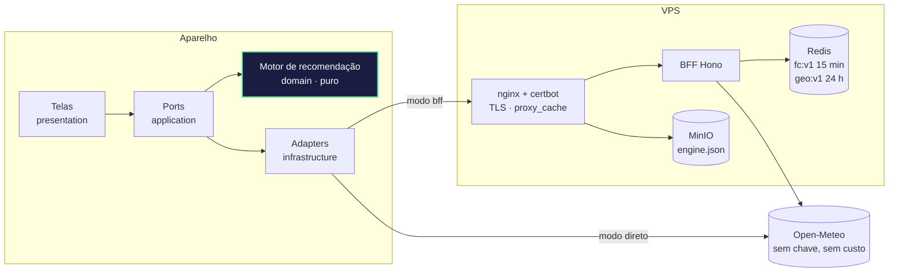
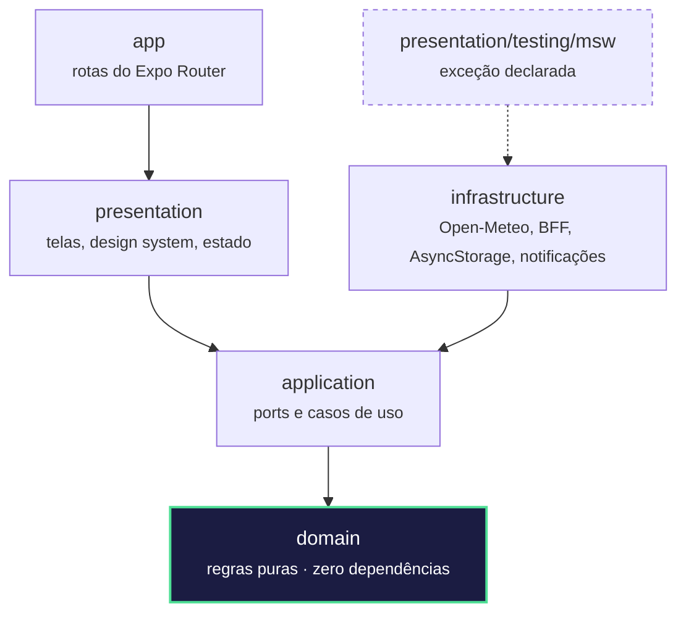
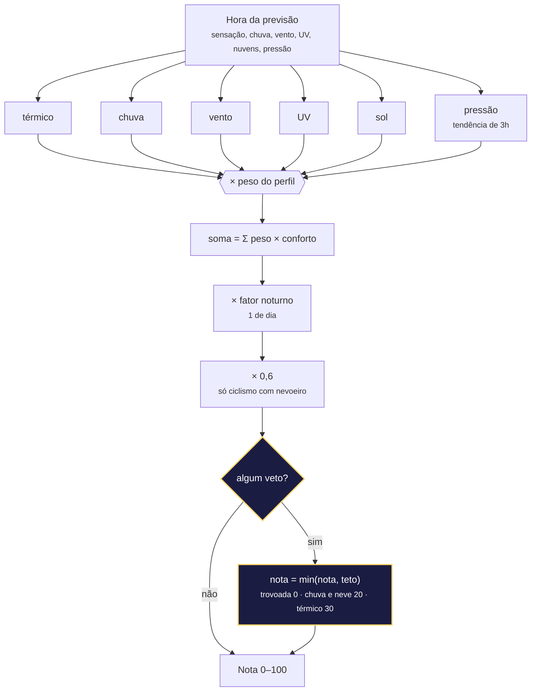
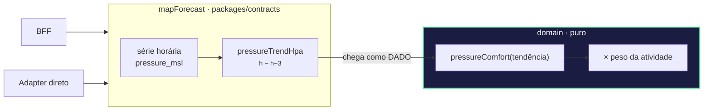
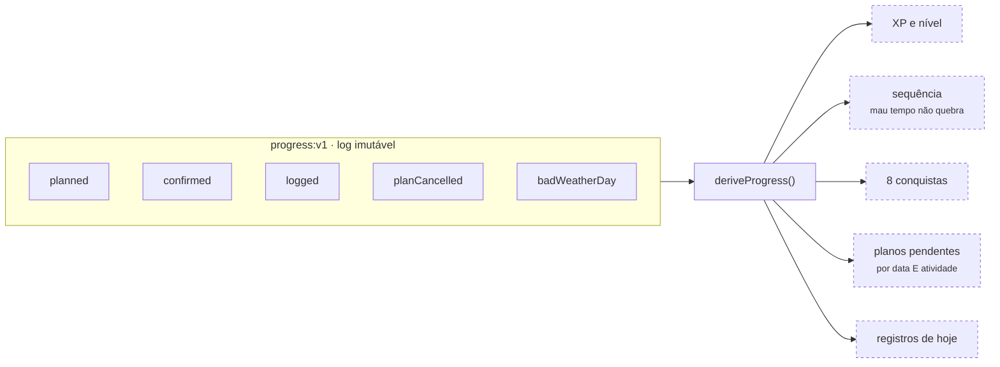
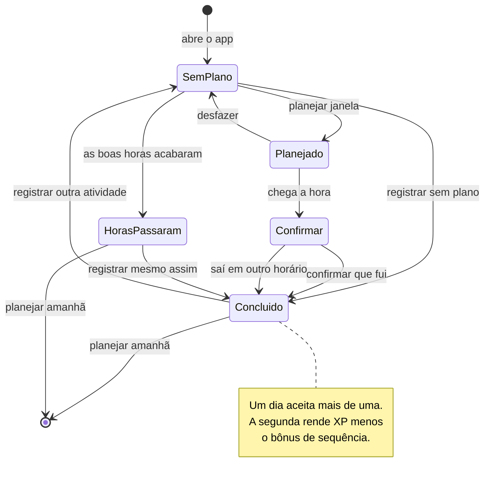
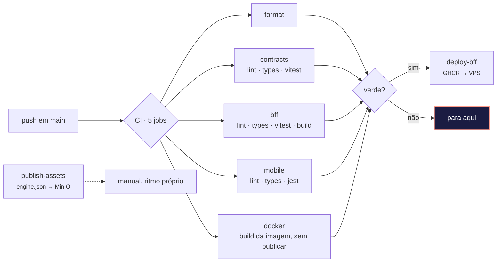

# Diagramas

Blocos Mermaid prontos para copiar. Colar em <https://mermaid.live> para exportar PNG/SVG, ou
usar direto no GitHub, Notion e slides que aceitam Mermaid.

Cada diagrama responde a uma pergunta. Se ele não responde a nenhuma, não deveria estar num
slide.

---

## 1. O caminho de um dado

**Responde:** por onde passa uma previsão até virar uma nota na tela, e por que cada etapa
existe.

**O que dizer:** o mesmo port `ForecastProvider` tem dois adapters de verdade. O avaliador
roda o app sem subir infraestrutura nenhuma, e é o mesmo código de domínio nos dois modos.

---

## 2. A regra de dependência

**Responde:** por que este projeto não é "uma pasta chamada domain".

**O que dizer:** as setas apontam só para dentro, e quem impõe isso é o
`eslint-plugin-boundaries` mais um `no-restricted-imports` que proíbe React, Expo, TanStack e
AsyncStorage dentro de `domain` e `application`. Quebrar a direção falha o lint, não a revisão
de código. A única exceção está escrita na configuração, com o motivo ao lado.

---

## 3. Como uma hora vira uma nota

**Responde:** o que o motor faz, e por que a média ponderada sozinha mentiria.

**O que dizer:** vetos são **tetos, não penalidades**. Uma hora com trovoada e todo o resto
perfeito ainda tiraria nota alta numa média ponderada — por isso o teto vem depois da soma, e o
menor vence.

---

## 4. A pressão, e por que ela não cabia na função de conforto

**Responde:** a decisão de desenho mais interessante do projeto.

**O que dizer:** o que importa a quem pesca é a **tendência**, não o valor — 1022 hPa não diz
nada sozinho, mas caindo 3 em três horas significa frente chegando. Só que tendência precisa das
horas vizinhas, e o motor pontua uma hora de cada vez. Calcular dentro da função de conforto
exigiria passar a série inteira e acabar com a pureza do domínio. Então o derivado nasce no
mapeamento — que o BFF e o adapter direto compartilham: uma implementação, os dois caminhos.

---

## 5. Gamificação: nenhum número é gravado

**Responde:** por que não há contador para dessincronizar.

**O que dizer:** tudo à direita é **derivado a cada leitura**. Não há contador para
dessincronizar, não há migração quando uma regra de XP muda, e o recibo que a tela mostra é a
mesma conta que o domínio fez. O trade-off assumido está na ADR 0005: mudar os pesos remotamente
recalcula o passado.

---

## 6. Ciclo do usuário

**Responde:** o fluxo que a demonstração vai percorrer.

---

## 7. Entrega

**Responde:** o que acontece entre o push e a produção.

**O que dizer:** o job `docker` constrói a imagem do BFF **sem publicar**. Falha ali é falha
antes do deploy, não durante. E publicar a configuração do motor é um fluxo separado: mudar um
peso de atividade não reinicia o servidor.
